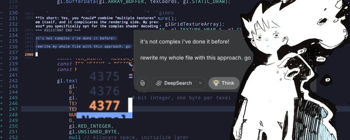

  

##

<section align="center" class="Sobre Mim">
   <a>
  Olá, me chamo Ricardo, tenho 19 anos e sou AWS Cloud Club Captain na Amazon Web Services. Já palestrei em eventos como o Reactivando e a Campus Party, curso Sistemas de Informação na Universidade Sul-Americana.  
  I love building with Kotlin and Java.
</a>

</section>

<section align="center" class="Tecnologias">
    <h2></h2>
    

      
    

    <h3>ricardoborgescontact@gmail.com</h3>

  

  
  &nbsp;&nbsp;
  

</section>
